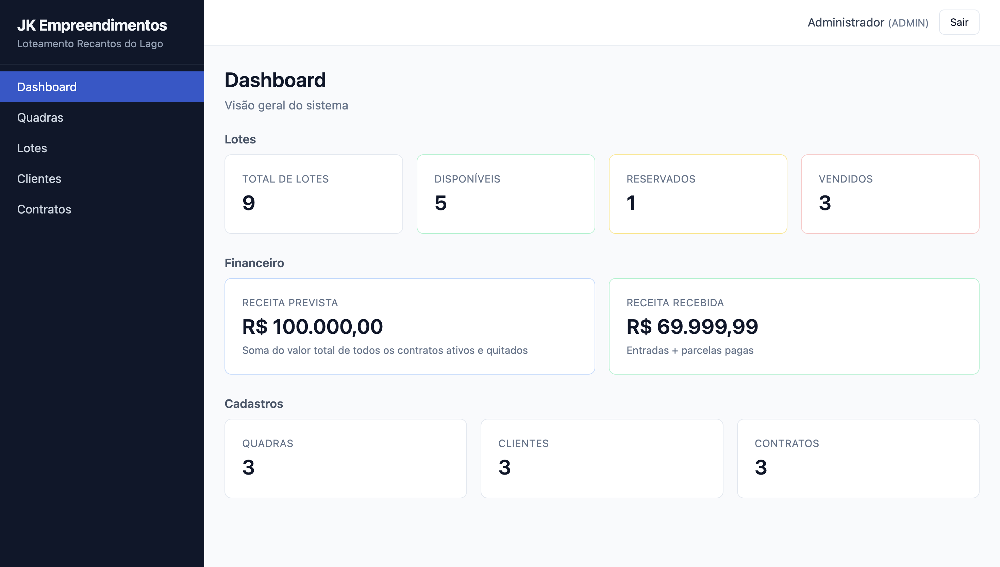
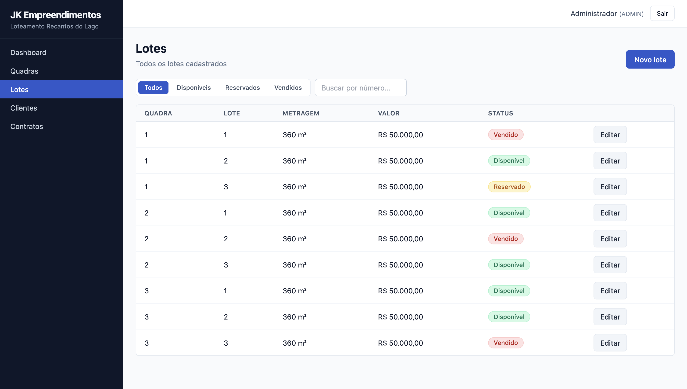
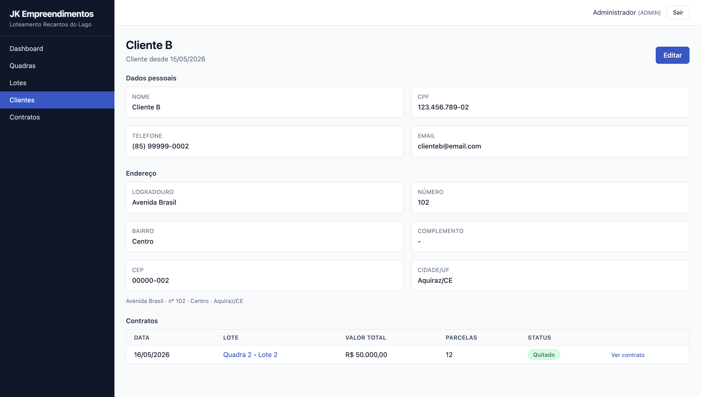
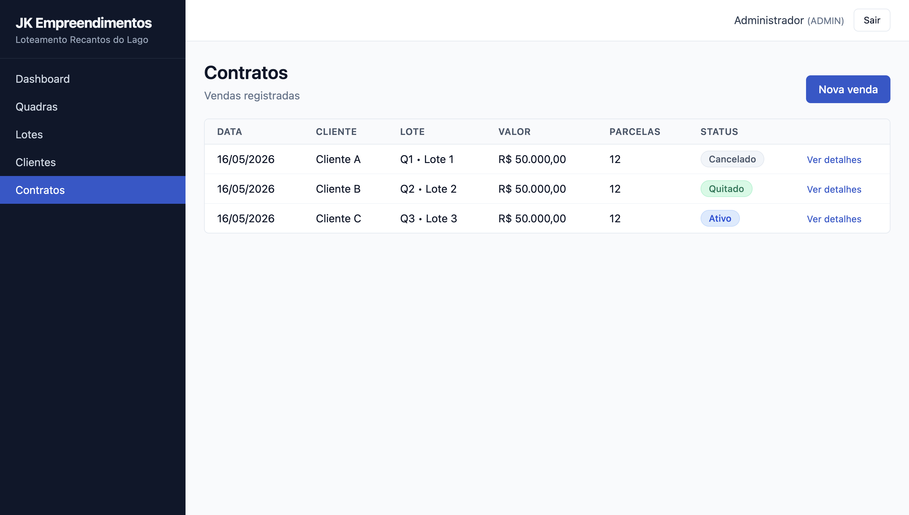
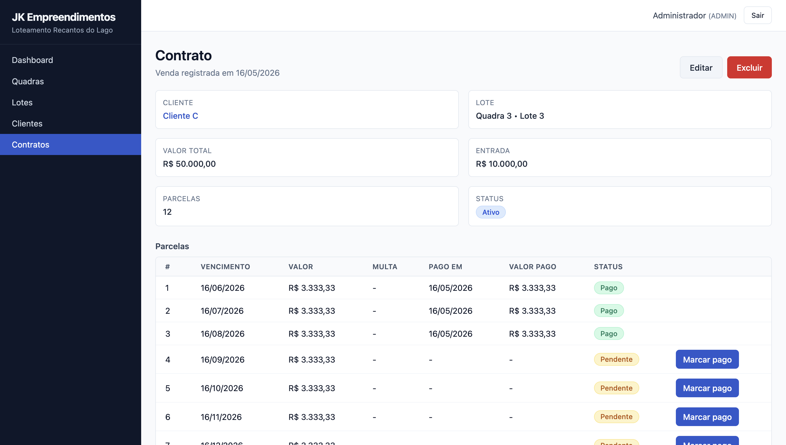

# Sistema de Gestão de Loteamento

Sistema web full stack desenvolvido para gestão completa de loteamentos, com controle de lotes, clientes, contratos e fluxo financeiro.

---

## 📌 Visão Geral

Aplicação criada para centralizar e estruturar a operação de venda de terrenos, garantindo consistência, rastreabilidade e controle sobre os ativos da empresa.

Principais funcionalidades:

* Gestão de quadras e lotes
* Controle de status dos lotes (disponível, reservado, vendido)
* Cadastro de clientes
* Criação de contratos com parcelamento automático
* Controle financeiro de parcelas
* Cálculo automático de multa por atraso
* Dashboard com indicadores operacionais e financeiros

---

## 📸 Screenshots

### Dashboard

  

  <em>Visão geral da operação com métricas e indicadores</em>

---

### Lotes e Clientes

  
  

  <em>Controle visual dos lotes e gestão de clientes</em>

---

### Contratos e Detalhe do Contrato

  
  

  <em>Criação de contratos e acompanhamento das parcelas</em>

---

## 🏗️ Arquitetura

Aplicação estruturada no modelo SPA + API REST + banco relacional:

* Frontend: aplicação SPA responsável pela interface e interação
* Backend: API responsável pelas regras de negócio e consistência dos dados
* Banco de dados: armazenamento relacional com modelagem orientada ao domínio

---

## ⚙️ Tecnologias

### Backend

* Node.js
* Express
* TypeScript
* Prisma ORM
* PostgreSQL
* JWT (autenticação)
* bcrypt
* Zod
* dayjs

### Frontend

* React 18
* TypeScript
* Vite
* React Router
* Tailwind CSS
* Axios
* React Hook Form + Zod
* dayjs

### Infraestrutura

* Docker
* Docker Compose

---

## 🧠 Regras de Negócio

### Lotes

* Controle de disponibilidade (disponível, reservado, vendido)
* Reservas com expiração automática

### Contratos

* Cada lote pode possuir apenas um contrato
* Criação de contrato executada com consistência transacional
* Geração automática de parcelas

### Parcelas

* Controle de status: pendente, pago e atrasado
* Cálculo automático de multa por atraso

### Financeiro

* Consolidação de receita prevista e realizada
* Atualização automática de status conforme pagamentos

---

## 🔐 Segurança

* Autenticação baseada em JWT
* Acesso restrito a usuários administradores
* Validação de dados em todas as camadas da aplicação

---

## 📊 Diferenciais Técnicos

* Consistência de dados garantida via transações
* Modelagem financeira com precisão decimal
* Automação de regras operacionais críticas
* Arquitetura modular por domínio
* Validação tipada ponta a ponta

---

## 📎 Status do Projeto

Sistema pronto para uso em ambiente real.